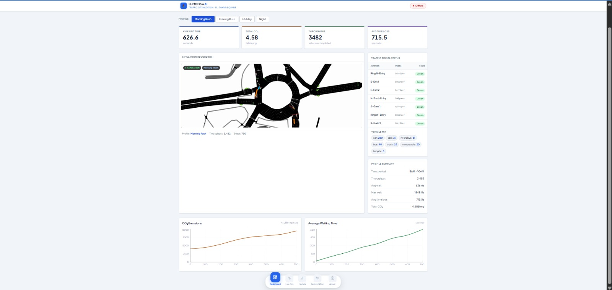
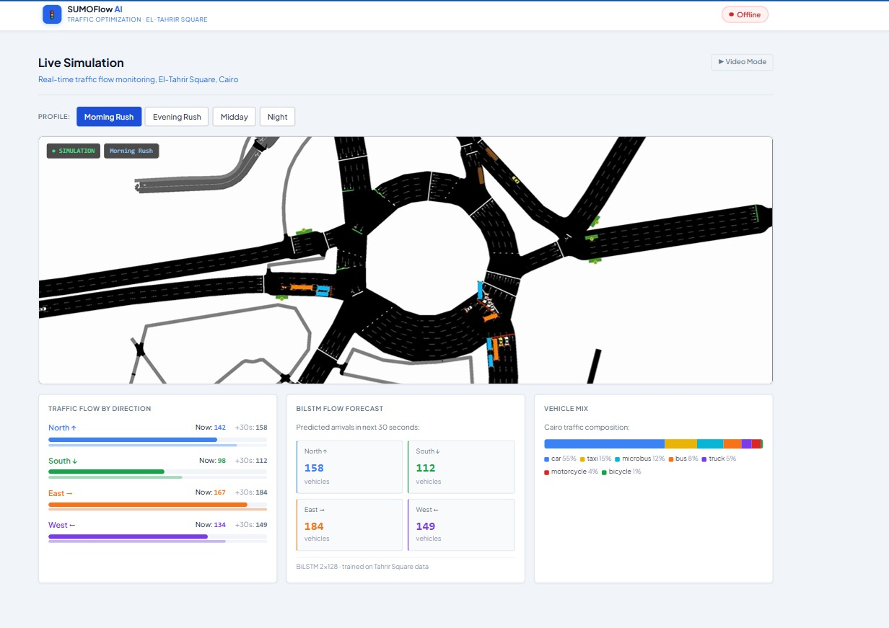
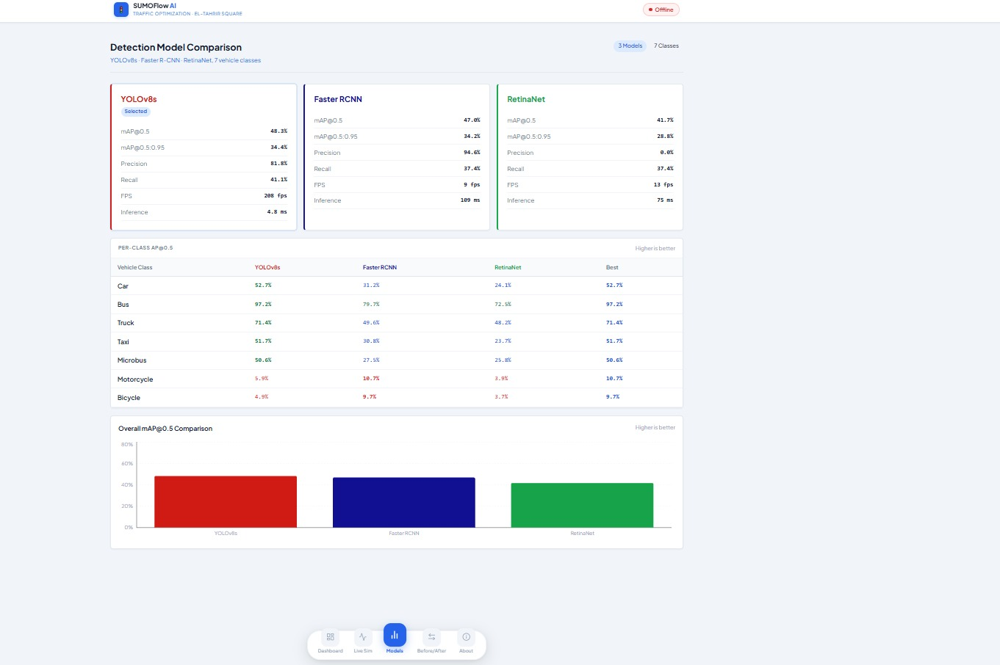
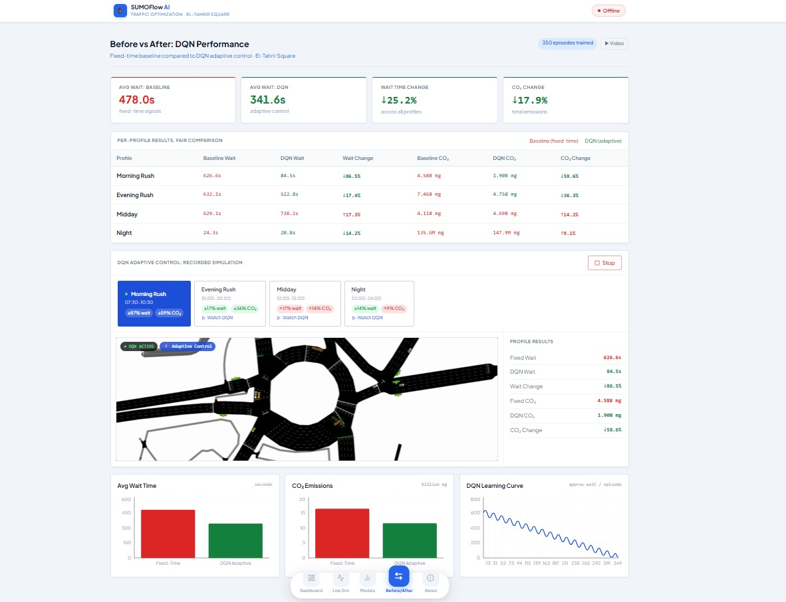
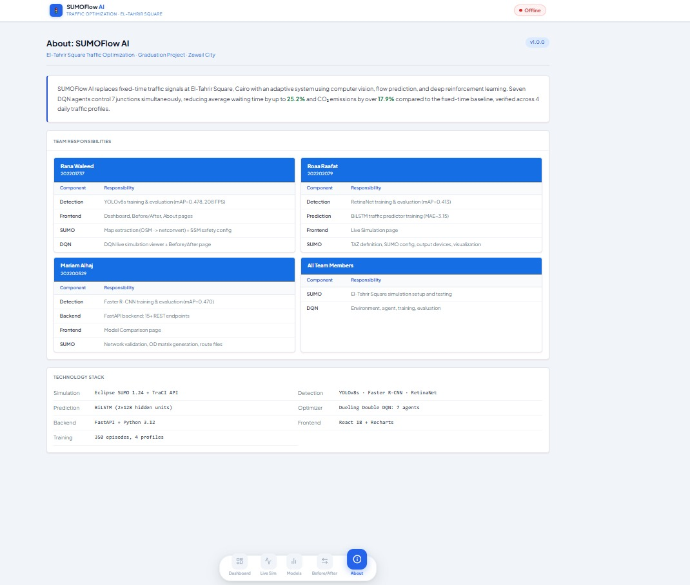

# Reducing Traffic Congestion and Estimations at Urban Intersections Through Deep Reinforcement Learning and Computer Vision

Live demo: [cute-entremet-5bea9e.netlify.app 
](https://cute-entremet-5bea9e.netlify.app) 
  
---

## Team Members

| Name | Student ID | Program |
|---|---|---|
| Rana Waleed | 202201737 | DSAI |
| Roaa Raafat | 202202079 | DSAI |
| Mariam Alhaj | 202200529 | DSAI|

**Supervisor:** Dr. Mohamed Maher Ata  
**University:** Zewail City of Science, Technology and Innovation

---

## Problem Statement

El-Tahrir Square in Cairo is one of the most congested intersections in the city. The current traffic signals run on fixed timing plans that do not respond to real traffic conditions, meaning vehicles wait just as long at 3 AM as they do during morning rush hour. During peak times, average waiting times exceed 600 seconds per vehicle, which wastes fuel, increases CO2 emissions, and adds significant delays for commuters every single day.

We built SUMOFlow AI to tackle this. The idea is to replace the fixed signal plans with a system that actually watches the traffic, predicts what is coming, and adjusts the signals in real time to reduce waiting as much as possible.

---

### Dataset Preparation (Auto-Labeling)

- Generating 1,800 labeled training images with zero manual annotation using the Neon Trick:
  
| Step | Tool   | Action                                          |
| ---- | ------ | ----------------------------------------------- |
| 1    | SUMO   | Render 1,800 simulation frames                  |
| 2    | TraCI  | Assign a unique neon color to each vehicle type |
| 3    | OpenCV | Isolate neon-colored pixels and detect contours |
| 4    | OpenCV | Generate bounding boxes and extract coordinates |
| 5    | Export | Save 1,800 YOLO `.txt` annotation files         |

- Neon color key (per vehicle type):
   Each of the 7 vehicle classes (car, microbus, bus, truck, motorcycle, bicycle, taxi) is assigned    a distinct neon RGB value.
   OpenCV isolates each color channel to auto-generate bounding boxes per class.
   Result: 1,800 images + 1,800 labels — fully automated.

---
## Features

- Vehicle detection using three models: YOLOv8s, Faster R-CNN, and RetinaNet , detecting 7 vehicle types (car, taxi, bus, microbus, truck, motorcycle, bicycle)
- BiLSTM model that predicts vehicle flow per direction (North, South, East, West) 30 seconds into the future
- Multi-agent Deep Q-Network (DQN) with 7 independent agents controlling 7 junctions simultaneously
- SUMO microscopic traffic simulation of El-Tahrir Square with 4 daily traffic profiles
- FastAPI backend connecting the simulation, AI models, and frontend
- React dashboard showing live simulation, detection results, and before/after comparison
- Monitoring and explainability modules covering AI governance requirements
- Successfully tested on a second city, Taksim Square in Istanbul, with no code changes

---
## System Architecture

The system works as a pipeline. SUMO runs the traffic simulation and TraCI connects Python to it. Every 10 simulation steps, the system collects lane sensor data, runs the BiLSTM to predict upcoming flow, and feeds everything into the DQN agents. Each agent decides whether to keep the current signal phase or switch it. The decision gets applied back to the simulation via TraCI and the cycle repeats.

```
SUMO Simulation
      |
   TraCI API  (every 10 simulation steps)
      |
  Lane sensor data collection
      |
  YOLOv8s vehicle detection  (from simulation screenshots)
      |
  BiLSTM flow prediction  (next 30 seconds, per direction)
      |
  7 DQN agents  (one per junction, 37-feature state vector)
      |
  Phase apply via TraCI
      |
  FastAPI backend  -->  React frontend
```

The frontend has two modes: live mode when the backend is running locally, and video mode for the deployed version which uses our recorded simulation videos.

---

## Technologies Used

**Frontend**
- React 18
- Recharts
- React Router v6
- Netlify for deployment

**Backend**
- FastAPI
- Python 3.12
- Uvicorn

**AI and ML**
- YOLOv8s (Ultralytics) — primary detection model, 71.2% mAP@0.5
- Faster R-CNN (PyTorch): 68.1% mAP@0.5, compared
- RetinaNet (PyTorch): 65.8% mAP@0.5, compared
- BiLSTM (PyTorch): 2 layers, 128 hidden units per direction
- Dueling Double DQN (PyTorch): 7 agents, 37-feature state, 350 training episodes

**Simulation**
- Eclipse SUMO 1.24
- OpenStreetMap for map export
- TraCI Python API

---

## Project Structure

```
sumoflow-ai-traffic-optimization/
├── frontend/
│   ├── src/
│   │   ├── pages/          Dashboard, LiveSimulation, BeforeAfter, ModelComparison, About
│   │   ├── components/     Navbar, MetricCard, TrafficLightStatus
│   │   └── hooks/          useSimMode (live/video detection), useIsMobile
│   └── public/
│       └── videos/         8 recorded simulation videos (4 baseline + 4 DQN)
├── backend/
│   ├── main.py
│   ├── routers/            simulation, models, dqn, sumo_control, lstm
│   └── services/           sumo_runner, dqn_runner, yolo_detect
├── DeepQN/
│   ├── agent/              DQNAgent, MultiAgentDQN, Dueling network architecture
│   ├── env/                SumoEnv, reward function
│   ├── training/           train.py
│   ├── evaluation/         evaluate.py, metrics.py
│   ├── monitoring/         DQNMonitor — detects degradation and alerts
│   ├── explainability/     DQNExplainer — human-readable decision explanations
│   ├── tests/              test_ai_behavior.py
│   ├── configs/            dqn_config.yaml, dqn_taksim_config.yaml
│   ├── checkpoints/        trained model weights
│   └── results/            evaluation_report.json
├── detection/              YOLOv8s, Faster R-CNN, RetinaNet training and weights
├── lstm/                   BiLSTM model, training scripts, scaler
├── simulation/
│   ├── maps/               El-Tahrir Square — net, routes, configs, baseline outputs
│   └── taksim/             Taksim Square generalization test
├── logs/                   DQN decision logs, training CSV files
├── AI_GOVERNANCE.md
└── README.md
```

---

## Setup Instructions

### What you need before starting

- Python 3.12
- Conda (Anaconda or Miniconda)
- Node.js 18 or higher
- Eclipse SUMO 1.24: download from https://sumo.dlr.de
- Git

### Step 1 — Clone the repository

```bash
git clone https://github.com/ranna-waleed/sumoflow-ai-traffic-optimization.git
cd sumoflow-ai-traffic-optimization
```

### Step 2 — Set SUMO_HOME

This is required for TraCI to work. Set it to wherever you installed SUMO.

On Windows:
```powershell
[System.Environment]::SetEnvironmentVariable("SUMO_HOME", "C:\Program Files (x86)\Eclipse\Sumo", "User")
```

On Mac or Linux:
```bash
export SUMO_HOME="/usr/share/sumo"
```

### Step 3 — Create the environment
Option 1 (using conda)
```bash
conda create -n sumoflow_env python=3.12
conda activate sumoflow_env
```

Option 2 (using git)
```bash
python -m venv sumoflow_env
sumoflow_env\Scripts\activate
```


### Step 4 — Install Python packages

```bash
pip install fastapi uvicorn torch torchvision ultralytics numpy pandas pyyaml scikit-learn
```

### Step 5 — Install frontend packages

```bash
cd frontend
npm install
cd ..
```

---

## Deployment Instructions

### Running locally

Open two terminals:

**Terminal 1 — Backend:**
```bash
cd backend
uvicorn main:app --port 8000 --workers 1
```

**Terminal 2 — Frontend:**
```bash
cd frontend
npm start
```

Open http://localhost:3000 in your browser. The app will detect the backend and switch to live simulation mode automatically.

### Building for deployment

```bash
cd frontend
npm run build
```

The `frontend/build/` folder is the production build. Drag it to Netlify to deploy. No backend needed for the deployed version — it runs entirely on pre-recorded videos and static evaluation data.

---

## Usage Guide

**Dashboard**: Start here. Pick a traffic profile and click Start to launch the SUMO simulation. You will see the live feed from SUMO-GUI alongside real-time metrics for vehicle count, average wait time, and CO2 emissions.

**Live Simulation**: Same simulation with a focus on directional flow. The BiLSTM panel shows predicted vehicle arrivals per direction for the next 30 seconds. The vehicle mix panel breaks down what types of vehicles are currently in the network.

**Model Comparison**: Shows the detection results for all three models side by side. Each model's mAP, precision, recall, and FPS are listed, along with per-class AP for all 7 vehicle types. YOLOv8s was selected as the primary model.

**Before vs After**: This is the main results page. The top section shows overall KPIs across all profiles. Clicking any profile launches the DQN simulation and shows junction decisions updating in real time. The charts at the bottom compare waiting time, CO2, and the DQN learning curve over 350 training episodes.

**About**: Project overview, team information, pipeline steps, and technology stack.

---

## Evaluation Results

The baseline is a standalone SUMO run with the original fixed-time signal plans — no Python involved, just raw SUMO output read from XML files.

| Traffic Profile | Average Wait Time Change | CO₂ Emissions Change |
| --------------- | ------------------------ | -------------------- |
| Morning Rush    | ↓ 86.5%                  | ↓ 58.6%              |
| Evening Rush    | ↑ 17.4%                  | ↑ 36.3%              |
| Midday          | ↓ 17.3%                  | ↓ 14.2%              |
| Night           | ↑ 14.2%                  | ↓ 9.1%               |
| **Overall**     | **↓ 25.2%**              | **↓ 17.9%**          |


All KPIs passed across all 4 profiles. DQN was trained for 350 episodes across all profiles.

---

## Training the DQN

Trained checkpoints are already in `DeepQN/checkpoints/` so you do not need to retrain. If you want to:

```bash
# Start training from scratch
python -m DeepQN.training.train --episodes 50

# Resume from existing checkpoints
python -m DeepQN.training.train --episodes 100 --resume DeepQN/checkpoints
```

---

## Running Evaluation

```bash
python -m DeepQN.evaluation.evaluate
```

Results are saved to `DeepQN/results/evaluation_report.json`.

---

## Running AI Behavior Tests

```bash
python -m DeepQN.tests.test_ai_behavior
```

This runs 12 edge case tests covering empty network, sensor failure, maximum congestion, determinism, and multi-agent independence.

---

## API Documentation

The backend exposes a full REST API. When running locally, interactive docs are available at http://127.0.0.1:8000/docs.

| Method | Endpoint | Description |
|---|---|---|
| GET | `/health` | Check if backend is running |
| GET | `/api/simulation/metrics/{profile}` | Get historical metrics for a profile |
| GET | `/api/simulation/profiles` | List available profiles |
| POST | `/api/sumo/start` | Start a SUMO simulation |
| POST | `/api/sumo/stop` | Stop the simulation |
| POST | `/api/sumo/step` | Advance N steps and return screenshot + metrics |
| GET | `/api/models/comparison` | Detection model comparison data |
| POST | `/api/dqn/sim/start/{profile}` | Start DQN adaptive simulation |
| POST | `/api/dqn/sim/stop` | Stop DQN simulation |
| GET | `/api/dqn/sim/status` | Get live DQN metrics and junction decisions |
| GET | `/api/dqn/results` | Full evaluation results |
| GET | `/api/lstm/predict/live` | Get BiLSTM prediction for current traffic |

Traffic profile options: `morning_rush`, `midday`, `evening_rush`, `night`

---

## Environment Requirements

```
Python          3.12
SUMO            1.24.0
Node.js         18+
torch           2.0+
ultralytics     8.0+
fastapi         0.100+
uvicorn         0.23+
numpy           1.24+
pandas          2.0+
pyyaml          6.0+
scikit-learn    1.3+
react           18.0
recharts        2.0+
react-router-dom 6.0+
```

---

## Screenshots

**Dashboard**


**Live Simulation**


**Model Comparison**


**Before vs After**


**About**


---

## Database Schema

This project does not use a traditional database. All persistent data is stored as flat files:

- `DeepQN/checkpoints/*.pt`: trained model weights per junction per episode
- `DeepQN/results/evaluation_report.json`: full evaluation results
- `DeepQN/logs/training_*.csv`: episode reward and metrics during training
- `logs/dqn_decisions_*.csv`: per-step decision log during live simulation (step, junction actions, avg wait, CO2, BiLSTM predictions, YOLO counts)
- `simulation/maps/baseline_outputs/*.xml`: SUMO tripinfo and emission XML files used as baseline

---

## AI Governance

Full documentation is in `AI_GOVERNANCE.md`. Summary:

| Point | Status | Key File |
|---|---|---|
| 0 — Why AI | Covered | AI_GOVERNANCE.md |
| 1 — Model understanding | Covered | DeepQN/agent/network.py |
| 2 — Data and inputs | Covered | DeepQN/env/sumo_env.py |
| 3 — Evaluation and metrics | Covered | DeepQN/results/evaluation_report.json |
| 4 — Testing AI behavior | 12/12 tests pass | DeepQN/tests/test_ai_behavior.py |
| 5 — Reliability and failure handling | Covered | backend/services/dqn_runner.py |
| 6 — Safety and governance | Covered | DeepQN/configs/dqn_config.yaml |
| 7 — Prompt design | Not applicable — no LLM used | — |
| 8 — System integration | Covered | backend/main.py |
| 9 — Performance and cost | Covered | All inference runs locally on CPU |
| 10 — Monitoring | Covered | DeepQN/monitoring/monitor.py |
| 11 — Explainability | Covered | DeepQN/explainability/explainer.py |
| 12 — Improvement strategy | Covered | DeepQN/training/train.py |
| 13 — Ethical AI | Covered | DeepQN/env/reward.py |

---

## Output Files

The following files are too large to store in the repository and are available on Google Drive:

https://drive.google.com/drive/u/0/folders/1ULhxaaJfYKngSDmra5949AVY5koPnaeH

The Drive folder contains:
- Detection model outputs — YOLOv8s, Faster R-CNN, and RetinaNet training results, weights, and evaluation metrics
- DQN checkpoints — trained model weights for all 7 junctions across 350 training episodes
- DQN training logs — reward per episode, epsilon decay, and step-level decision logs
- SUMO baseline outputs — tripinfo and emission XML files for all 4 Tahrir Square profiles
- Taksim Square outputs — baseline simulation outputs and pipeline test results
- Detector output XMLs — lane area detector data from the simulation runs
  
## Links

GitHub: https://github.com/ranna-waleed/sumoflow-ai-traffic-optimization  
Live demo: [cute-entremet-5bea9e.netlify.app 
](https://cute-entremet-5bea9e.netlify.app) 
  
